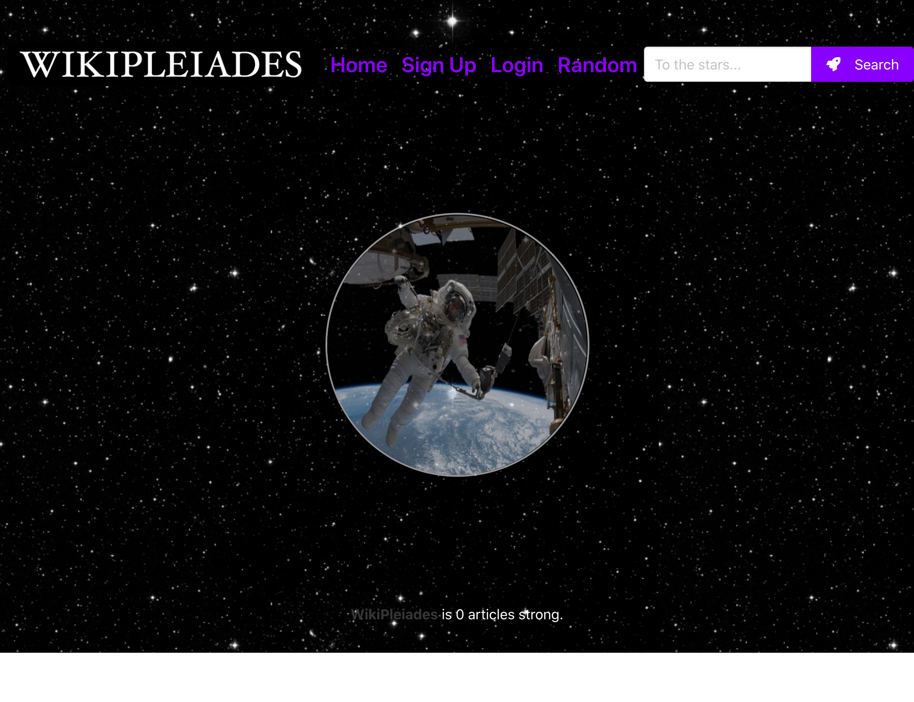
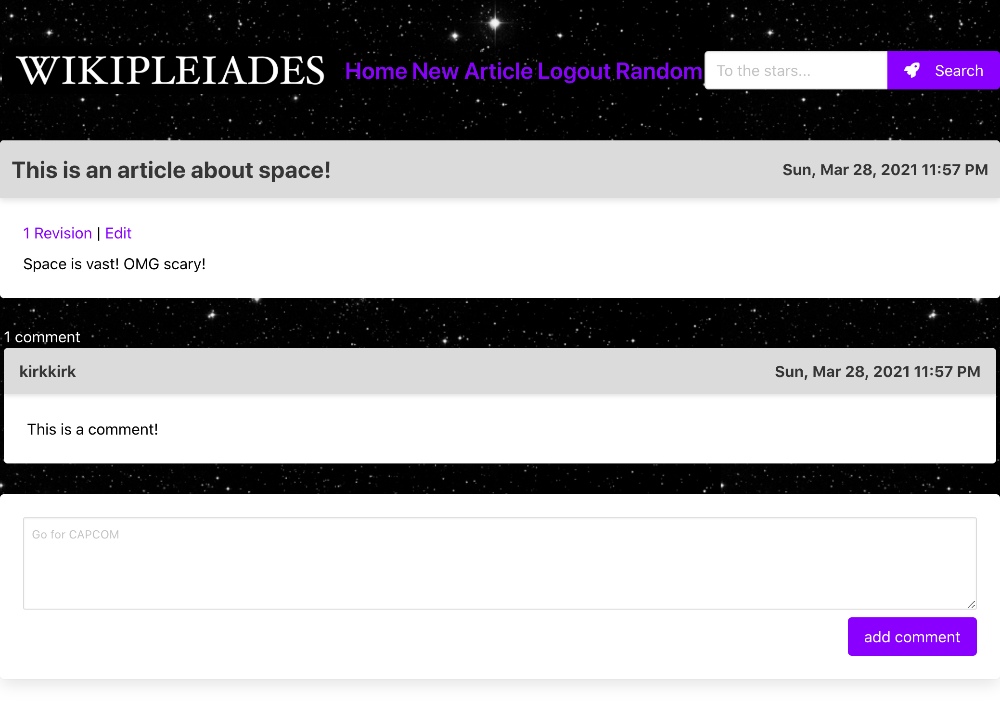

# WikiPleiades

---------------------------------------

## Description
A simple Wiki for astronomical enthusiasts to post articles about space and physics.  This is a collaborative site that allows users to post, revise and explore our articles as well as start conversations about them.  This project is just getting started, please watch this space for future endeavors!

---------------------------------------

Project Link: 
[WikiPleiades](https://enigmatic-savannah-82928.herokuapp.com/)

---------------------------------------

## Usage

Visit our website and explore or contribute!

---------------------------------------

Written using:

                    
* JavaScript
   
* HTML
   
* CSS
   
* ES6
   
* jQuery
   
* Node
   

---------------------------------------

## Questions

                     
* [Akram Sabbah](https://github.com/akramsabbah9)
                     
* [Kirk Balopoulos](https://github.com/kirkbalop)

* [Nina Cummings](https://github.com/jaderiver62)

For any input, concerns, bugs or questions please get in touch!  Simply reach out to one of us via GitHub or via e-mail: jaderiver64@gmail.com.

---------------------------------------

## Licence

#### This project is licensed under the [MIT License](https://opensource.org/licenses/MIT).
#### &copy; 2021 Akram Sabbah, Nina Cummings & Kirk Balopoulos

---------------------------------------
    
